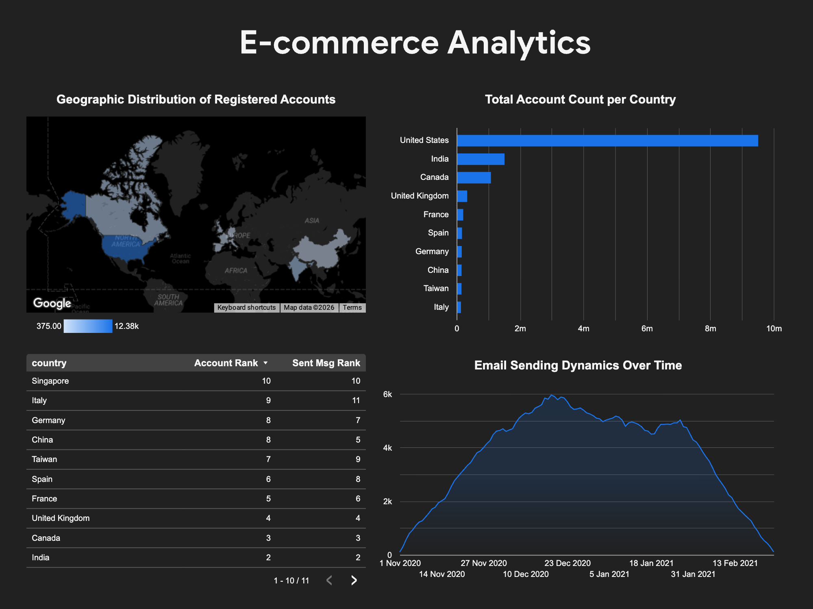

# E-commerce Analytics: Account & Email Performance

A BigQuery SQL project analyzing account registration dynamics and email engagement across countries for an e-commerce platform.

---

## Project Overview

This project builds a unified reporting dataset that combines two key business dimensions:

- **Account metrics** — how many accounts were created, by date and country
- **Email engagement metrics** — how many emails were sent, opened, and clicked

The final output ranks countries by subscriber count and email volume, returning only the **top 10 markets** by either metric — ready for visualization in Looker Studio.

---

## Data Sources (BigQuery — project `data-analytics-mate`, dataset `DA`)

| Table | Description |
|---|---|
| `session` | Web sessions with date |
| `session_params` | Session metadata incl. country |
| `account` | Account attributes (send_interval, is_verified, is_unsubscribed) |
| `account_session` | Session ↔ account mapping |
| `email_sent` | Sent email records |
| `email_open` | Email open events |
| `email_visit` | Email click/visit events |

---

## Query Logic

The query is structured with **6 CTEs** to keep each logical step isolated and readable.

```
registration_base   →  account counts grouped by date, country, settings
email_metrics       →  sent / open / visit counts with derived date
combined_data       →  UNION ALL of both datasets (zero-fill opposing metrics)
grouped_dataset     →  collapse duplicates with SUM + GROUP BY
total_metrics       →  country-level totals via SUM() OVER (PARTITION BY country)
ranked_data         →  DENSE_RANK() by total subscribers & sent messages
```

**Final filter:** `rank_total_country_account_cnt <= 10 OR rank_total_country_sent_cnt <= 10`


---

## Output Columns

| Column | Type | Description |
|---|---|---|
| `date` | DATE | Registration date (accounts) or send date (emails) |
| `country` | STRING | Country |
| `send_interval` | INTEGER | Account's configured send interval |
| `is_verified` | BOOLEAN | Whether account is verified |
| `is_unsubscribed` | BOOLEAN | Whether account is unsubscribed |
| `account_cnt` | INTEGER | Number of accounts created |
| `sent_msg` | INTEGER | Emails sent |
| `open_msg` | INTEGER | Emails opened |
| `visit_msg` | INTEGER | Email link clicks |
| `total_country_account_cnt` | INTEGER | Total accounts for country (all dates) |
| `total_country_sent_cnt` | INTEGER | Total sent messages for country (all dates) |
| `rank_total_country_account_cnt` | INTEGER | Country rank by subscriber count |
| `rank_total_country_sent_cnt` | INTEGER | Country rank by sent volume |

---

## Data Studio (Looker Studio) Dashboard

The dataset powers a Looker Studio dashboard with:

- **Geographic map** — account distribution by country
- **Bar chart** — total account count per country
- **Table** — country rankings by accounts and sent messages
- **Time series** — email sending dynamics over time



**Key findings:**

- United States leads in both subscriber count and email volume
- India and Canada are the 2nd and 3rd largest markets
- Peak email activity occurred in late December 2020 – early January 2021
- Taiwan ranks 7th by accounts but 9th by sent volume — indicating lower engagement rate relative to subscriber count

---

## SQL Concepts Used

- `WITH` (Common Table Expressions — CTEs)
- `UNION ALL` for dataset combination
- Window functions: `SUM() OVER (PARTITION BY ...)`, `DENSE_RANK() OVER (ORDER BY ...)`
- Multi-table `JOIN` chains
- `LEFT JOIN` for optional engagement events
- `DATE_ADD()` for date offset calculation
- Aggregation with `COUNT(DISTINCT ...)` and `SUM()`

---

## Author

**Olha Klochnyk** — Data Analyst

Tools: BigQuery · SQL · Looker Studio
